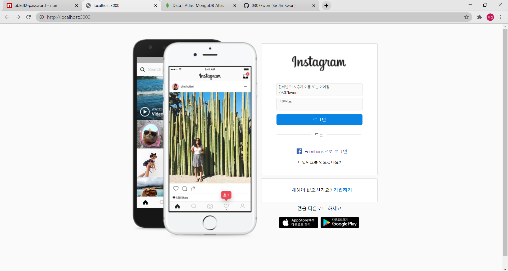

# instagram_clone_coding

# 1. 개요

인스타그램과 외관과 기능이 똑같은 웹페이지를 만드는 것이 목표입니다.

# 2. 사용된 기술

NodeJS(express)

ES6

MongoDB

pbkdf2(password)

session

multer

# 3. 이론

패스워드 보안

       
       
- 기본 원리 
       
    단방향 암호화 : 암호화는 가능하지만 반대로 복호화는 불가능한 암호화방법을 사용하여

    비밀번호를 해싱하고, db에 비밀번호 원본을 저장하는 것이 아닌 해싱값을 저장한다.

    ⇒ 로그인 시 비밀번호 일치여부를 확인 할 때에는 입력된 비밀번호를 암호화하여

    db에 저장된 해싱값과 비교한다. 

    단방향 암호화의 예시 : hd5 (이제 더이상 쓰지 않음, 취약점이 발견됨),

    sha256 (이걸 요즘 쓴다는데 또 취약점이 발견되었을 수 있음)
    
- salt

    비밀번호 자체만 암호화를 하게되면, 모든 값의 해시을 저장해서 사전처럼 만들어

    뚫을 수가 있다.

    여기서 비밀번호+salt값(salt는 겹치지않는 랜덤한값)을 해싱을 하면

    좀 더 뚫기가 힘든 암호가 만들어진다.

    모든 사용자마다 salt값은 다른것이 좋다. ( salt값이 같다면 한명이 뚫렸을때 다른 모든 사람도 뚫릴 위험성이 존재하기 때문)

- key streching

    단방향 암호화를 여러번 반복하는 것 (보안성이 높다)

    (암호화된 것을 또 암호화 또 암호화.... 반복)

    ex) PBKDF2
    

로그인 기능

       
       
mongoose+session 기능을 조합하여 만듦 

[https://www.npmjs.com/package/connect-mongoose-only](https://www.npmjs.com/package/connect-mongoose-only) 

이 패키지를 참고. (몽구스에 세션을 저장하는데 편리하게 만들어져 있음)

# 4. 프로젝트 진행 상황

[2020.10.05] 게시판 기능 (사진 + 글) 

       
       

- 글 작성시 script태그를 막아두지 않았음 (보안이슈)

[2020.10.14] 로그인 완성 

       
       

- mongoose+session 기능을 조합하여 만듦 

- 지속적인 css 작업중.

[2020.11.05]세션 기능 추가, 패스워드 암호화

1. 세션 기능 추가

    이제 로그아웃을 하지 않으면 로그인 상태가 계속 유지됩니다.
    
    

2. 패스워드 암호화

    pbkdf2-password 패키지를 사용하여 구현

    - pbkdf2-password
        - hasher() : 비밀번호를 salt에 맞게 암호화하는 함수

            salt가 없을 시 salt를 자동으로 만들어 암호화한다.

    

